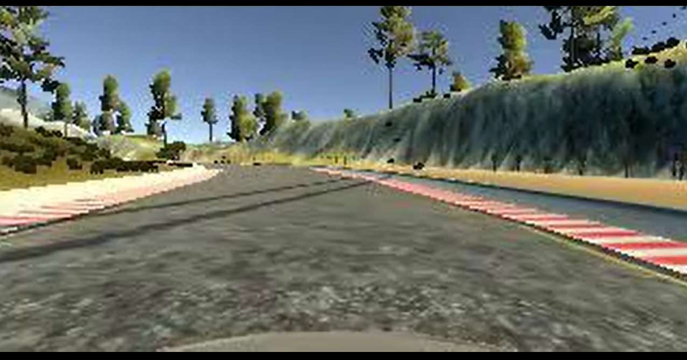

# CarND-Project3_Behavioral_Cloning

## Using Skill
- Deep Learning
- Keras
- Convolutional Neural Networks

## Detail
- Built and trained a convolutional neural network for end-to-end driving in a simulator, using TensorFlow and Keras.
- Used optimization techniques such as regularization and dropout to generalize the network for driving on multiple tracks.

